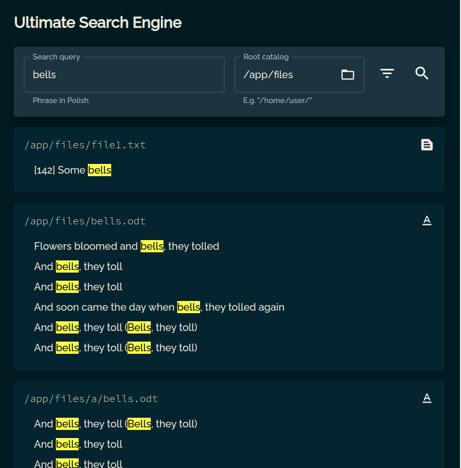
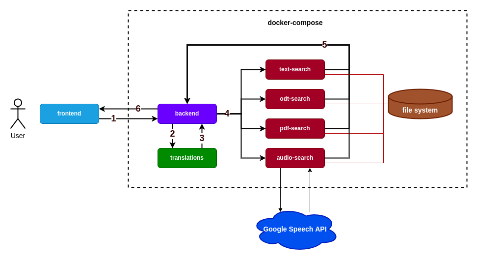

# Ultimate Search Engine
## Description
This app allows searching for files containing a specified phrase in a directory.
Supported formats:
* text (.txt, .md)
* Open Document (.odt, .odf)

To be added:
* pdf
* sound
* movies

## Running the app
To run the app, run the following command from the project's root directory:

`docker-compose --env-file .env.dev up`

You can access the app at `http://localhost:3000/`.

## Architecture diagram

## Components
### [fronted](./frontend/README.md)
The user-facing application. It sends all requests to the backend and presents the results. 

Technologies: TypeScript, React, Material-UI

### [backend](./backend/README.md)
Responsible for parsing requests from the frontend app, converting them to individual requests 
per each microservice. Then it gathers the responses from the microservices and sends the 
results back to the frontend as a single response.

Additionally, before communicating with microservices, it checks if the path from the request
exists. 

Technologies: Kotlin, Gradle, Spring

### [text-search](./text-search/README.md)
Finds all .md and .txt files containing the phrase in a given directory.

Technologies: C#, .NET

### [odt-search](./odt-search/README.md)
Finds all .odt and .odf files containing the phrase in a given directory.

Technologies: Java, Maven, Restlet, ODFDOM

### [pdf-search](./pdf-search/README.md)
Finds all .pdf files containing the phrase in a given directory.

Technologies: Scala, sbt, Apache PDFBox

### [audio-search](./audio-search/README.md)
Finds all .wav files containing the phrase in a given directory.

Technologies: Python, flask

### [translation](./translation/README.md)
Translates phrase into specified languages.

Technologies: Node, express

