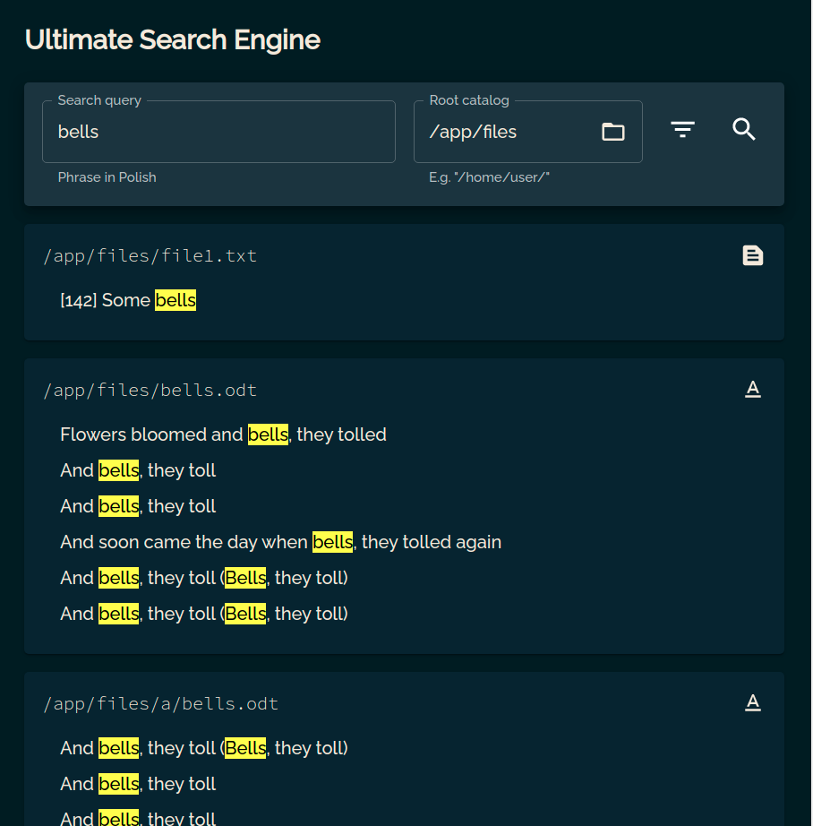

# frontend

Entry point for the users. Provides a friendly UI, which allows searching 
for files containing a phrase in a given directory. Additionally, the user
can filter the desired format of files.

### Available at

`http://localhost:3000`

### Screenshots

