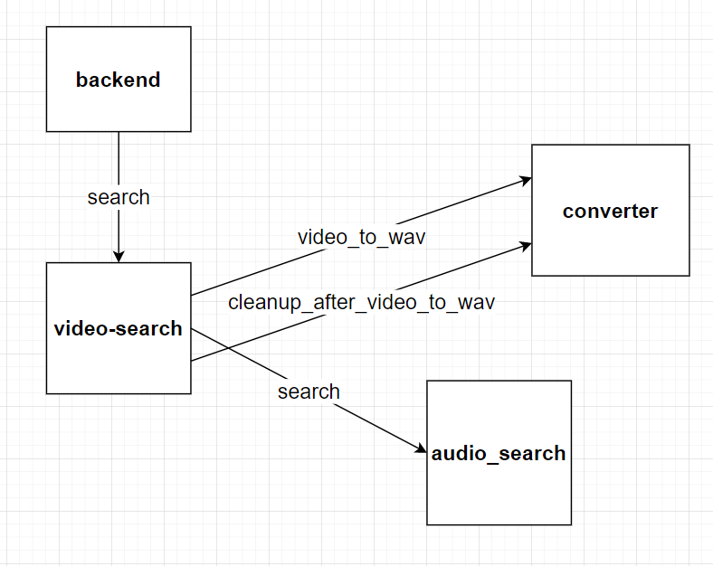

#### Concept for audio in video search
1. There will be a new service called video-search
2. It will handle audio from video initially but might be extended to handle image from video
3. To search for audio from video it will:
    - Make a call to converter to extract .wav files from all handled video extensions
    - Make a call to audio-search to search for audio in tmp directory created by converter
    - Make a call to converter to cleanup after the audio extraction
    - Remap file paths
    - Send the result
    
Communication with other services would look like that:
  


Thanks to that solution we don't have to duplicate audio-search logic

#### Tools that can be used by converter
Ffmpeg is already needed by pydub so it is already installed in the converted. That means we can use it directly
(also because it doesn't seem like any good wrapper exists)

```python
import subprocess

subprocess.call("ffmpeg -i /app/files/video.mp4 -ab 160k -ac 2 -ar 44100 -vn /app/files/audio_from_video/video.wav", shell=True)
```

as suggested in this thread https://stackoverflow.com/questions/26741116/python-extract-wav-from-video-file

#### Other topics

As there should be not problem finding libs for rest and http requests for any programming languages, we can decide on 
which language should the video-search service be written in even just before the implementation
